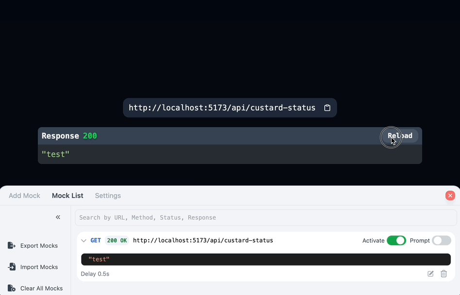
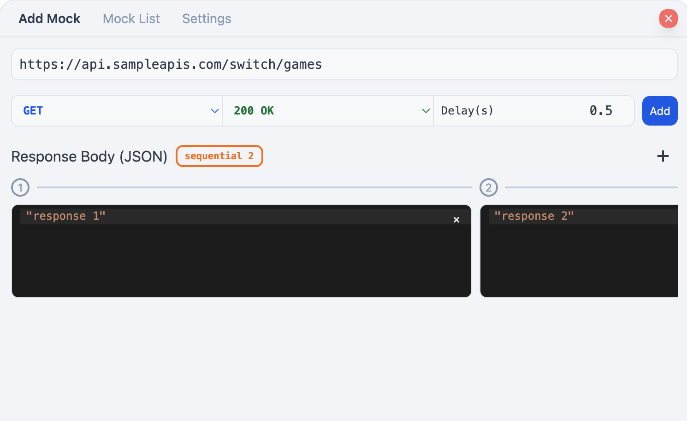

<br />
<br />

<h1 align="center">@custardcream/msw-devtools</h1>
<p align="center">
  <bold>Framework Agnostic Devtools for Managing MSW Handlers</bold>
  <br />
  <span>Easily manage your mock request handlers</span>
</p>

<p align="center">
  <a href="https://www.npmjs.com/package/@custardcream/msw-devtools" target="_blank"></a>
  <br />
  <br />
  <a href="https://github.com/custardcream98/msw-devtools">ENGLISH</a> | <a href="https://github.com/custardcream98/msw-devtools/blob/main/README/KO/README.ko.md">한국어</a>
</p>

<br />
<br />

## Features

- **Framework-Agnostic.** Works with any framework, including React, Vue, and more.
- **Easily Manage Mock Request Handlers.** Add, edit, delete, enable, or disable mock request handlers with ease.
- **Use Different Response Data Based on the Situation.** Change response data sequentially.
- **Export and Import Mock Request Handlers.** Easily share mock request handlers in JSON format.
- **Live JSON Editing for Instant Management of MSW Request Handlers.** Changes made in the Devtools UI are instantly synced with your JSON file. ([🔗](#live-json-editing-for-instant-management-of-msw-request-handlers))
- **Prompt Mode for Real-time Response Control.** Manually enter response data for each request through an interactive modal. ([🔗](#prompt-mode-for-real-time-response-control))

<br />

<p align="center">
  
  
  
  
</p>

<br />
<br />

## Demo

**[React.js Demo](https://msw-devtools.vercel.app/)**

**[Vue.js Demo](https://msw-devtools-vue.vercel.app/)**

## Installation

To get started, install the package via npm:

```bash
npm install -D @custardcream/msw-devtools msw
```

Before integrating, make sure you have set up MSW in your project.

```bash
npx msw init public
```

### Integrating with React.js

```jsx
import { setupWorker } from "msw/browser"
import { installMSWDevtools } from "@custardcream/msw-devtools"

const enableMocking = async () => {
  // Exclude devtool from production builds
  if (import.meta.env.DEV) {
    return await installMSWDevtools({
      initialOpen: true, // Automatically open devtool on start
      setupWorker: setupWorker(), // Initialize MSW worker
      options: { // MSW worker options
        onUnhandledRequest: "bypass",
      }
    })
  }
}

// You can use any framework you like
enableMocking().then(() =>
  ReactDomClient.createRoot(document.getElementById("root")!).render(
    <React.StrictMode>
      <App />
    </React.StrictMode>
  )
)
```

### Integrating with Vue.js

```js
const enableMocking = async () => {
  if (import.meta.env.DEV) {
    return await installMSWDevtools({
      initialOpen: true,
      setupWorker: setupWorker(),
      options: {
        onUnhandledRequest: "bypass"
      }
    })
  }
}

enableMocking().then(() => {
  const app = createApp(App)

  app.mount("#app")
})
```

## Handling Dynamic Requests (sequential response)

In various cases, you may want to make response data dynamic.

You can achieve this by using the sequential response feature.



This feature allows you to change the response data for each request sequentially.

## Prompt Mode for Real-time Response Control

Sometimes you need to provide different responses on the fly without pre-configuring them. Prompt Mode allows you to manually enter response data for each request in real-time.

<p align="center">
  
</p>

When a request is made with Prompt Mode enabled, a modal appears where you can directly input the JSON response data. This is particularly useful for:

- Testing edge cases without modifying your mock handlers
- Simulating different scenarios during demos or presentations
- Quickly experimenting with various response structures

To use Prompt Mode, simply toggle it on for a specific request handler in the Devtools UI.

### Prompt Mode vs. Sequential Response

- **Prompt Mode**: Allows you to manually enter response data at the moment a request occurs. Useful when you need to create responses on-the-fly without pre-planning.
- **Sequential Response**: Lets you pre-define multiple response values that will be returned in sequence (first request gets first response, second request gets second response, etc.).

Choose Prompt Mode when you need maximum flexibility during testing or demos. Use Sequential Response when you have a predictable series of responses needed for a specific test flow.

## Live JSON Editing for Instant Management of MSW Request Handlers

> (experimental) This feature is experimental and may change in the future.

<p align="center">
  
</p>

Using `@custardcream/msw-devtools-server`, you can create and update the request handler JSON file in real time through the Devtools UI.

Conversely, you can also directly edit the JSON file to reflect changes in your developing app in real time.

<a href="https://www.npmjs.com/package/@custardcream/msw-devtools-server" target="_blank"></a>

```bash
npm install -D @custardcream/msw-devtools-server
```

```js
// Add isUsingServer option to installMSWDevtools
installMSWDevtools({
  setupWorker: setupWorker(),
  isUsingServer: true // Enable server usage
})
```

**Be sure to start the server before you begin developing your project.**

For example, a Vite app can be configured as follows (using `concurrently`):

```json
{
  "scripts": {
    "start": "concurrently \"msw-devtools-server -o ./mock\" \"vite\""
  }
}
```

**Devtools prioritizes the JSON file over the Request Handler information stored in local storage. Please note that the values stored in local storage may be overwritten when connecting to the server.**

### CLI Options

- `-o, --output <path>`: Output file path(or directory) for the generated JSON file. (default: `./mock-list.json`)
- `-r, --recursive`: Read all JSON files in the directory.

### Managing Multiple JSON Files

You can manage JSON files by dividing them into folders.

```bash
msw-devtools-server --output ./mocks --recursive
```

```
mocks
└───folder1
│   │   mock-list.json
│   │   any-name.json
│   │
│   └───subfolder1
│       │   mock-list.json
│       │   ...
│
└───folder2
    │   JSON_FILE_NAME.json
```

> You must specify a directory for the `-o, --output` option.

> Failure to follow the JSON file schema may result in errors.

### Created JSON File's Scheme

The JSON file generated by `@custardcream/msw-devtools-server` follows the following scheme (in typescript):

```typescript
/**
 * JSON file scheme for managing MSW request handlers
 */
type JsonMock = Array<{
  url: string
  method: MethodOption
  status: StatusOption
  response: JsonMockResponse
  responseDelay: number
  isActivated: boolean
}>

type MethodOption =
  | "get"
  | "post"
  | "put"
  | "patch"
  | "delete"
  | "options"
  | "head"

type StatusOption = "200" | "201" | "400" | "401" | "403" | "404" | "500"

type JsonMockResponse =
  | {
      type: "single"
      response: any
    }
  | {
      type: "sequential"
      response: any[]
    }
```
