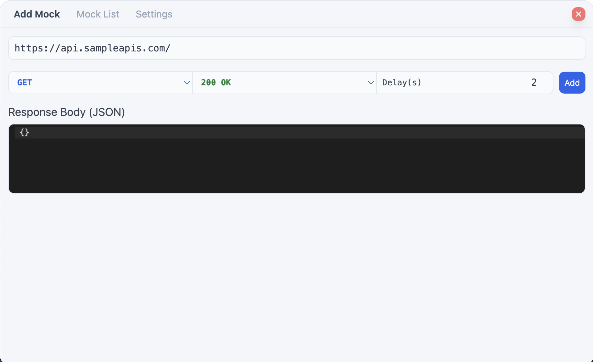
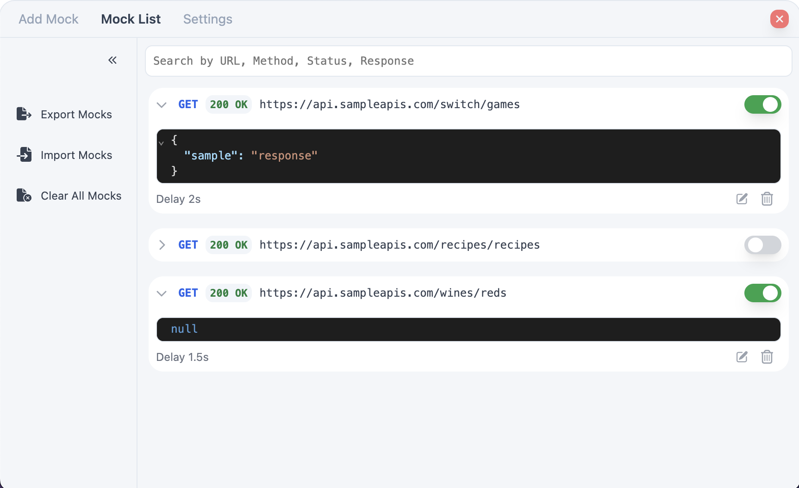
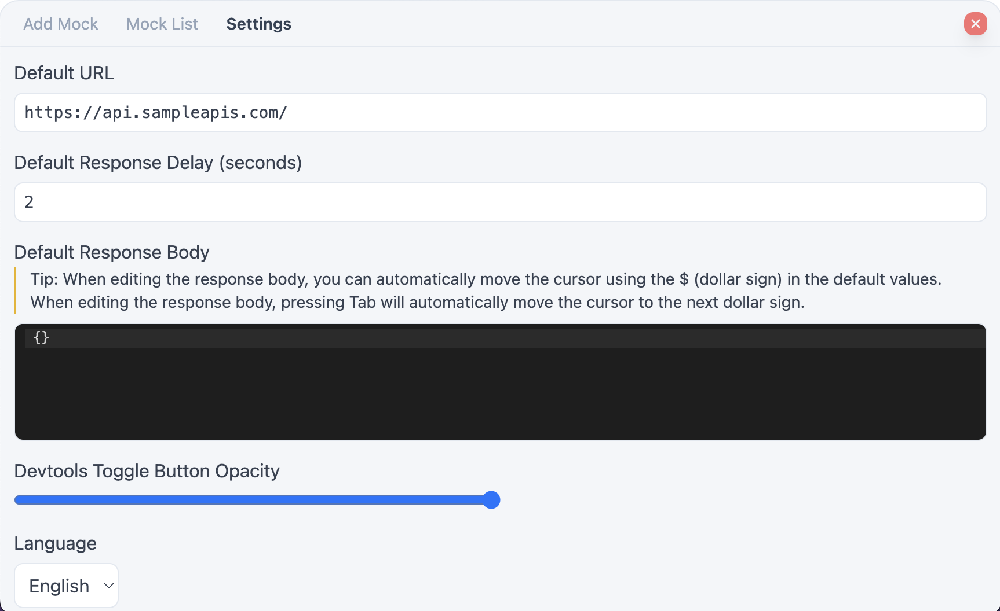

<h1 align="center">@custardcream/msw-devtools</h1>
<p align="center">
  <bold>Framework Agnostic Devtools for Managing MSW Handlers</bold>
  <br />
  <span>Easily manage your mock request handlers</span>
</p>

<p align="center">
  <a href="https://www.npmjs.com/package/@custardcream/msw-devtools" target="_blank"></a>
  <br />
  <a href="https://github.com/custardcream98/msw-devtools">ENGLISH</a> | <a href="https://github.com/custardcream98/msw-devtools/blob/main/README/KO/README.ko.md">한국어</a>
</p>

<br />
<br />

## Features

- **Framework-Agnostic.** Works with any framework, including React, Vue, Angular, Svelte, and more.
- **Easily Manage Mock Request Handlers.** Add, edit, delete, enable, or disable mock request handlers with ease.
- **Use Different Response Data Based on the Situation.** Change response data sequentially.
- **Export and Import Mock Request Handlers.** Easily share mock request handlers in JSON format.

<br />

<p align="center">
  
  
  
</p>

<br />
<br />

## Demo

**[Try Demo Here (React.js)](https://msw-devtools.vercel.app/)**

**[Try Demo Here (Vue.js)](https://msw-devtools-vue.vercel.app/)**

## Installation

To get started, install the package via npm:

```bash
npm install -D @custardcream/msw-devtools msw
```

## Usage

Here's how you can integrate it into your project:

```jsx
import { setupWorker } from "msw/browser"
import { installMSWDevtools } from "@custardcream/msw-devtools"

const enableMocking = async () => {
  // Exclude devtool from production builds
  if (import.meta.env.DEV) {
    return await installMSWDevtools({
      initialOpen: true, // Automatically open devtool on start
      setupWorker: setupWorker() // Initialize MSW worker
      options: { // MSW worker options
        onUnhandledRequest: "bypass",
      }
    })
  }
}

// You can use any framework you like
enableMocking().then(() =>
  ReactDomClient.createRoot(document.getElementById("root")!).render(
    <React.StrictMode>
      <App />
    </React.StrictMode>
  )
)
```

### Handling Dynamic Requests (sequential response)

In various cases, you may want to make response data dynamic.

You can achieve this by using the sequential response feature.


This feature allows you to change the response data for each request sequentially.
