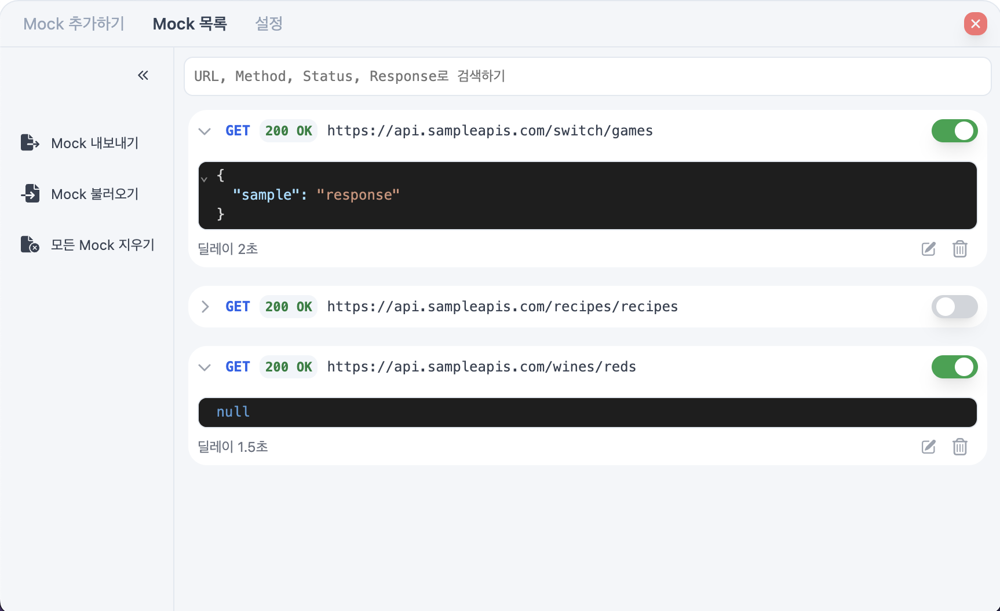
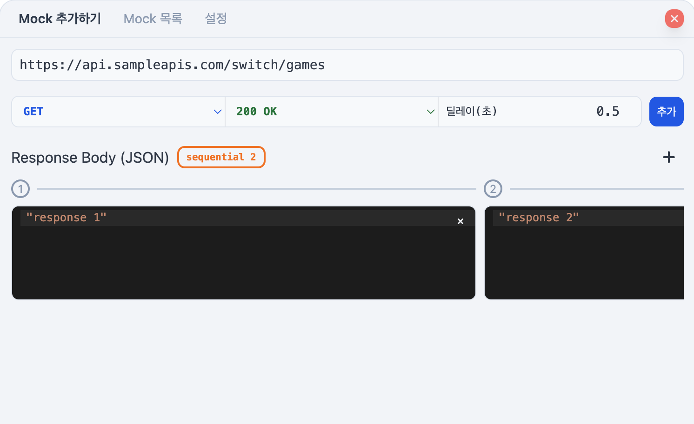

<h1 align="center">@custardcream/msw-devtools</h1>
<p align="center">
  <bold>프레임워크에 구애받지 않는 MSW 핸들러 관리 도구</bold>
  <br />
  <span>MSW 핸들러를 손쉽게 관리하세요!</span>
</p>

<p align="center">
  <a href="https://www.npmjs.com/package/@custardcream/msw-devtools" target="_blank"></a>
  <br />
  <br />
  <a href="https://github.com/custardcream98/msw-devtools">ENGLISH</a> | <a href="https://github.com/custardcream98/msw-devtools/blob/main/README/KO/README.ko.md">한국어</a>
</p>

<br />
<br />

## 주요 기능

- **어떤 프레임워크를 사용해도 상관없습니다.** React, Vue 등 어떤 프레임워크를 사용하더라도 사용할 수 있습니다.
- **Mock Request Handler를 UI로 편리하게 관리하세요.** 손쉽게 추가, 수정, 삭제하거나 활성화, 비활성화할 수 있습니다.
- **상황에 따라 다른 응답값을 사용하세요.** 응답값이 순차적으로 바뀌게 할 수 있습니다.
- **Mock Request Handler를 내보내거나 가져오세요.** JSON 포멧으로 손쉽게 Mock Request Handler를 공유할 수 있습니다.
- **실시간 JSON 편집으로 MSW 요청 핸들러를 쉽게 관리하세요.** Devtools UI에서 변경한 내용이 즉시 JSON 파일에 반영됩니다. ([🔗](#msw-요청-핸들러를-실시간-json-편집으로-즉시-동기화하기))
- 한국어를 지원합니다.

<br />

<p align="center">
  
  
  
</p>

<br />
<br />

## 데모

**[데모 페이지 (React.js)](https://msw-devtools.vercel.app/)**

**[데모 페이지 (Vue.js)](https://msw-devtools-vue.vercel.app/)**

## 설치 방법

npm을 통해 패키지를 설치하세요.

```bash
npm install -D @custardcream/msw-devtools msw
```

시작하기 전에 프로젝트에 MSW를 설정해주세요.

```bash
npx msw init public
```

### React.js 프로젝트에서 사용하기

```jsx
import { setupWorker } from "msw/browser"
import { installMSWDevtools } from "@custardcream/msw-devtools"

const enableMocking = async () => {
  // 프로덕션 빌드에서는 Devtools를 번들에 포함시키지 않습니다.
  if (import.meta.env.DEV) {
    return await installMSWDevtools({
      initialOpen: true, // Devtools 열린 상태로 시작
      setupWorker: setupWorker() // MSW 워커 초기화
      options: { // MSW 워커 설정
        onUnhandledRequest: "bypass"
      }
    })
  }
}

// 어떤 프레임워크를 사용해도 상관없습니다.
enableMocking().then(() =>
  ReactDomClient.createRoot(document.getElementById("root")!).render(
    <React.StrictMode>
      <App />
    </React.StrictMode>
  )
)
```

### Vue.js 프로젝트에서 사용하기

```js
const enableMocking = async () => {
  if (import.meta.env.DEV) {
    return await installMSWDevtools({
      initialOpen: true,
      setupWorker: setupWorker(),
      options: {
        onUnhandledRequest: "bypass"
      }
    })
  }
}

enableMocking().then(() => {
  const app = createApp(App)

  app.mount("#app")
})
```

## 응답값 다이나믹하게 변경하기 (sequential response)

응답값을 다이나믹하게 변경해야 할 경우, 'sequential response'를 사용하세요.



각 요청에 대한 응답값이 순차적으로 변경되게 됩니다.

## MSW 요청 핸들러를 실시간 JSON 편집으로 즉시 동기화하기

> (실험적) 이 기능은 실험적이며 향후 변경될 수 있습니다.

<p align="center">
  
</p>

`@custardcream/msw-devtools-server`를 사용하면 실시간으로 Devtools UI를 통해 요청 핸들러 JSON 파일을 생성, 갱신할 수 있습니다.

반대로, JSON 파일을 직접 편집해 개발중인 앱에 실시간으로 반영할 수도 있습니다.

```bash
npm install -D @custardcream/msw-devtools-server
```

**프로젝트 개발을 시작하기 전에 서버를 실행해야 합니다.**

예를 들어, Vite 앱은 이렇게 구성할 수 있습니다. (`concurrently` 사용)

```json
{
  "scripts": {
    "start": "concurrently \"msw-devtools-server -o ./mock\" \"vite\""
  }
}
```

**Devtools는 로컬 스토리지에 저장된 Request Handler 정보보다 JSON 파일을 우선합니다. 서버와 연결될 때 로컬 스토리지에 저장됐던 값이 덮어써질 수 있다는 점에 유의해주세요.**

### CLI Options

- `-o, --output <path>`: Output file path(or directory) for the generated JSON file. (default: `./mock-list.json`)
