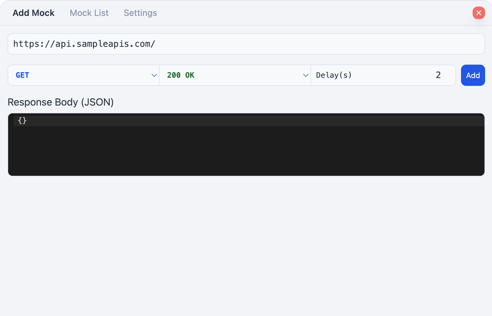
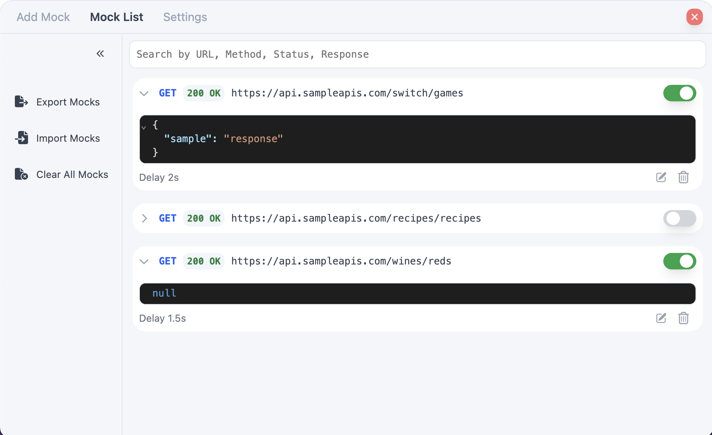
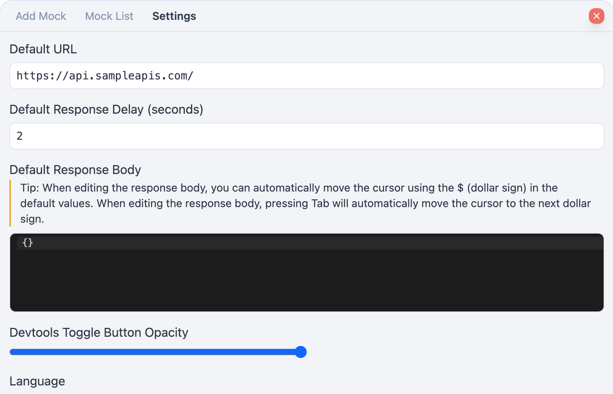

<div align="center">
  <h3 align="center">@custardcream/msw-devtools</h3>

  <p align="center">
    <bold>Framework Agnostic Devtools for Managing MSW Handlers</bold>
    <br />
    <span>Easily manage your mock request handlers</span>
    <br />
    <br />
    <a href="https://www.npmjs.com/package/@custardcream/msw-devtools"></a>
    <a href='https://www.npmjs.com/package/@custardcream/msw-devtools'></a>
    <br />
    <br />
    <strong>🛠 Add Mock Request Handlers On The Fly</strong>
    <br />
    <strong>✏️ Modify the Handler's Response Through the UI</strong>
    <br />
    <strong>🔄 Export/Import Mock Request Handlers</strong>
    <br />
    <br />
    <a href="#">ENGLISH</a> | <a href="./README/KO/README.ko.md">한국어</a>
  </p>
</div>

<br />

<p align="center">
  
  
  
</p>

<br />
<br />
<br />

## 📺 Demo

**[Try Demo Here (React.js)](https://msw-devtools.vercel.app/)**

**[Try Demo Here (Vue.js)](https://msw-devtools-vue.vercel.app/)**

## Main Features

- Add / Edit / Delete Mock Request Handlers
- Export / Import Mock Request Handlers
- Enable / Disable Mock Request Handlers
- Delay Mock Request

## 🚀 Installation

To get started, install the package via npm:

```bash
npm install -D @custardcream/msw-devtools msw
```

## 🛠 Usage

Here's how you can integrate it into your project:

```jsx
import { setupWorker } from "msw/browser"
import { installMSWDevtools } from "@custardcream/msw-devtools"

const enableMocking = async () => {
  // Exclude devtool from production builds
  if (import.meta.env.DEV) {
    return await installMSWDevtools({
      initialOpen: true, // Automatically open devtool on start
      setupWorker: setupWorker() // Initialize MSW worker
      options: { // MSW worker options
        onUnhandledRequest: "bypass",
      }
    })
  }
}

// You can use any framework you like
enableMocking().then(() =>
  ReactDomClient.createRoot(document.getElementById("root")!).render(
    <React.StrictMode>
      <App />
    </React.StrictMode>
  )
)
```
