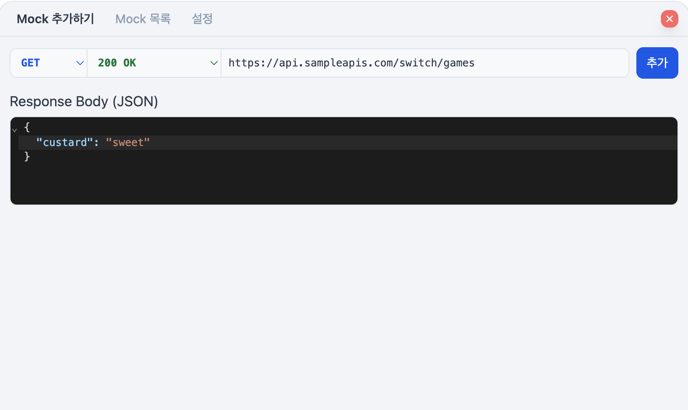
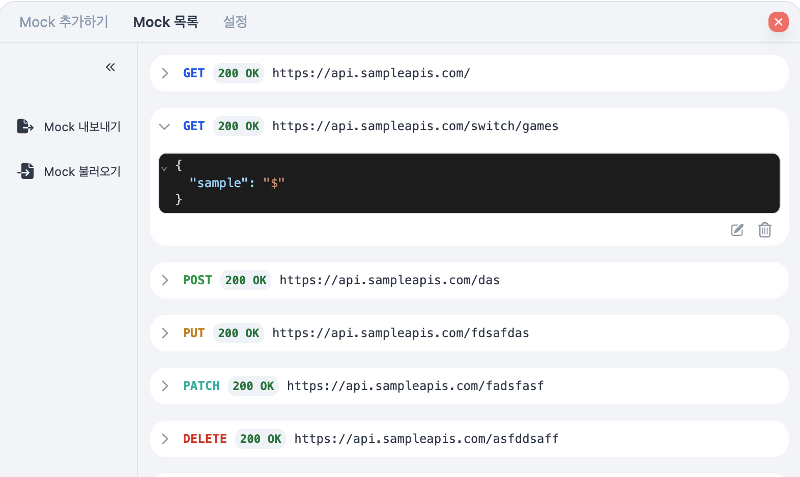

<div align="center">
  <h3 align="center">@custardcream/msw-devtools</h3>

  <p align="center">
    <bold>프레임워크에 구애받지 않는 MSW 핸들러 관리 도구</bold>
    <br />
    <span>MSW 핸들러를 손쉽게 관리하세요!</span>
    <br />
    <br />
    <a href="https://www.npmjs.com/package/@custardcream/msw-devtools"></a>
    <a href='https://www.npmjs.com/package/@custardcream/msw-devtools'></a>
    <br />
    <br />
    <strong>🛠 모킹 핸들러를 런타임에 자유롭게 추가</strong>
    <br />
    <strong>✏️ 모킹 핸들러의 응답을 UI로 수정</strong>
    <br />
    <strong>🔄 모킹 핸들러 내보내기/가져오기</strong>
    <br />
    <strong>🇰🇷 한국어 지원</strong>
    <br />
    <br />
    <a href="../README.md">ENGLISH</a> | <a href="#">한국어</a>
  </p>
</div>

<br />

<p align="center">
  
  
</p>

<br />
<br />
<br />

## 📺 데모

**[데모 페이지](https://msw-devtools.vercel.app/)**

## 🚀 설치 방법

npm을 통해 패키지를 설치하세요.

```bash
npm install -D @custardcream/msw-devtools msw
```

## 🛠 사용법

```jsx
import { setupWorker } from "msw/browser"
import { installMSWDevtools } from "@custardcream/msw-devtools"

const enableMocking = async () => {
  // 프로덕션 빌드에서는 Devtools를 번들에 포함시키지 않습니다.
  if (import.meta.env.DEV) {
    return await installMSWDevtools({
      initialOpen: true, // Devtools 열린 상태로 시작
      setupWorker: setupWorker() // MSW 워커 초기화
      options: { // MSW 워커 설정
        onUnhandledRequest: "bypass"
      }
    })
  }
}

// 어떤 프레임워크를 사용해도 상관없습니다.
enableMocking().then(() =>
  ReactDomClient.createRoot(document.getElementById("root")!).render(
    <React.StrictMode>
      <App />
    </React.StrictMode>
  )
)
```
